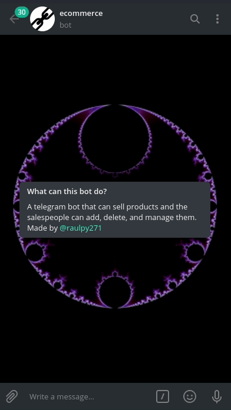
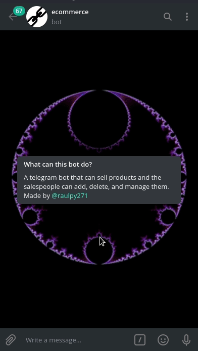
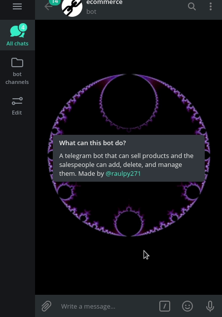
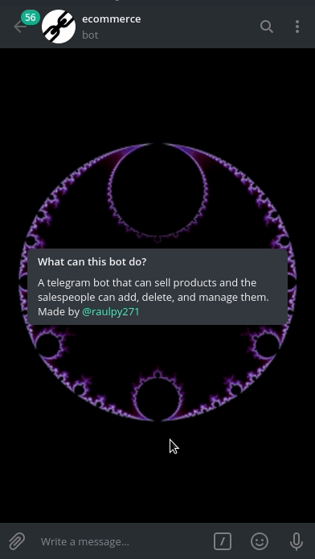

# 🤖 Telegram e-commerce

This is a Telegram bot made using the Python language. To connect with the Telegram API, I use the python-telegram-bot wrapper, and on the database side, I use MySQL.
## 💖 All Contributors

<a href="https://github.com/raulpy271/telegram_ecommerce/graphs/contributors">
 
</a>

## 🛠️ TODO

- Add a feature to change password.
- Add salt when storing the password.
- Add support for other languages.
- Add password confirmation when a user buys a product.
- The handler that adds a product in the database doesn't check if the description of the product has more characters than the description column has.
- When the user selects the command \show_categories more than once, the bot only shows products one time.
- Add a filter to block non-admin commands like /add_product and /add_category.

## ❓What can this bot do ?

This is a Telegram bot where you can buy items.

Sellers can add, delete, and manage them.

The following are instructions on how to use this bot:

- Type /show_categories to see products by category.
- To search for something, you can use the command /search.
- To buy something, you need to register a password. To do this, type /register.
- The admins can add products and categories with the commands /add_product and /add_category.

## 🚸 Tutorial

### Register Command



### Seeing products



### Making a payment


### Searching for a product



### Changing the language



## ⚙️ How to set up ?

First of all, see the dependencies in the requirements file or type pip install -r requirements.txt to install the dependencies automatically.

The second process is to create a bot with the Bot Father and get your bot token. To make test payments, you should have a token from a payment provider. Learn more about this on the Telegram payment page.

Now, put your tokens in the file /telegram_ecommerce/utils/user_credentials.json. In this file, you can put the admin's usernames and the credentials of your MySQL database. Moreover, you can change some settings in the consts.py file, like the default language.

After all, you can run the bot by typing:

```sh
 $ python bot.py
```

or, if you want to run the bot inside a container, use:

```sh
$ bash run.sh
```

📌 **PS**: To run the command above Docker is needed. Installation instruction [here.](https://docs.docker.com/engine/install/)

## 🛑 Disclaimer

This project is a demo, it's only for learning purposes. To be ready for production, many features need to be added.


